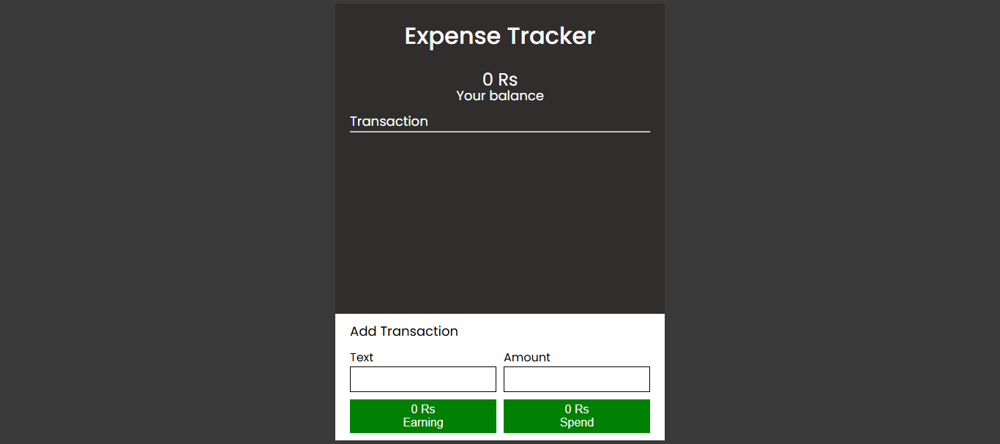

# 💰 Expense Tracker

 

A lightweight and user-friendly Expense Tracker app to help you manage your personal finances.  
Track your income, expenses, and view your balance — all updated in real-time using local storage.

 

## 🚀 Features

- Add income and expense transactions
- View transaction history
- Automatically calculate and display:
  - Total balance
  - Total income
  - Total expense
- Delete individual transactions
- Stores data in local storage (no database required)
- Responsive design

 

## 🛠️ Built With

- HTML
- CSS
- JavaScript (Vanilla JS)
- Local Storage API

 

## 📷 Screenshot

 

## 📄 License

This project is licensed under the MIT License – see the [LICENSE](LICENSE) file for details.
